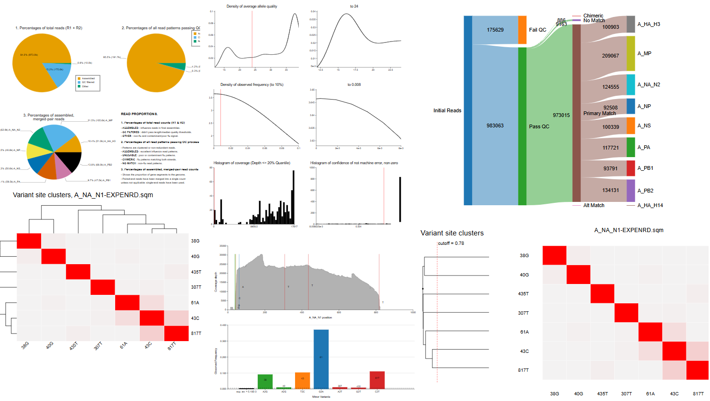
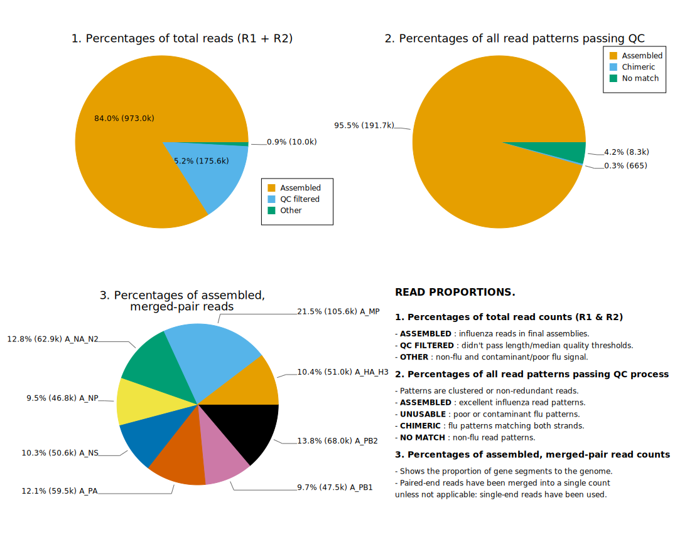
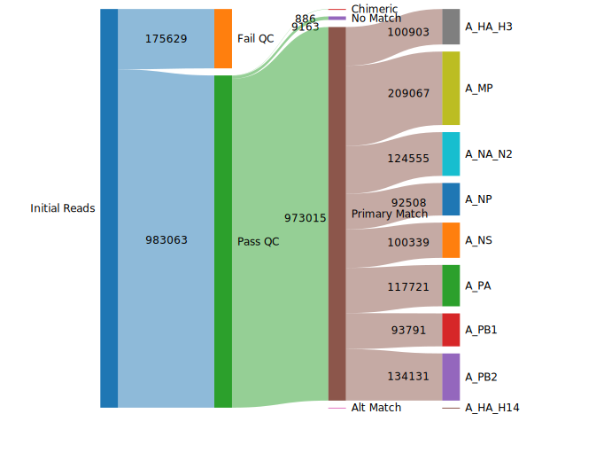
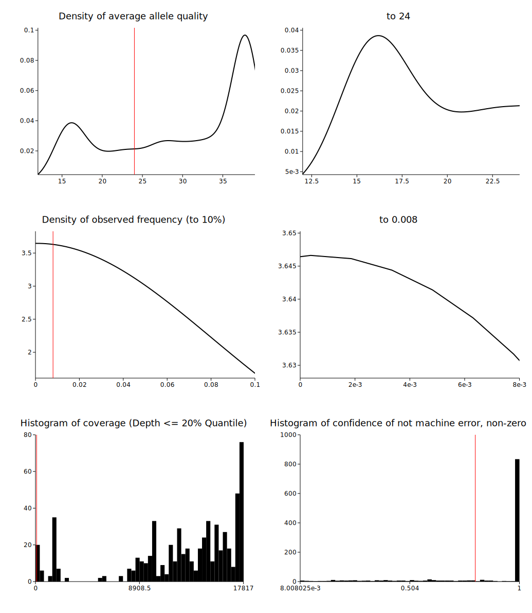
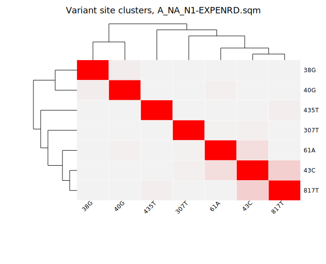
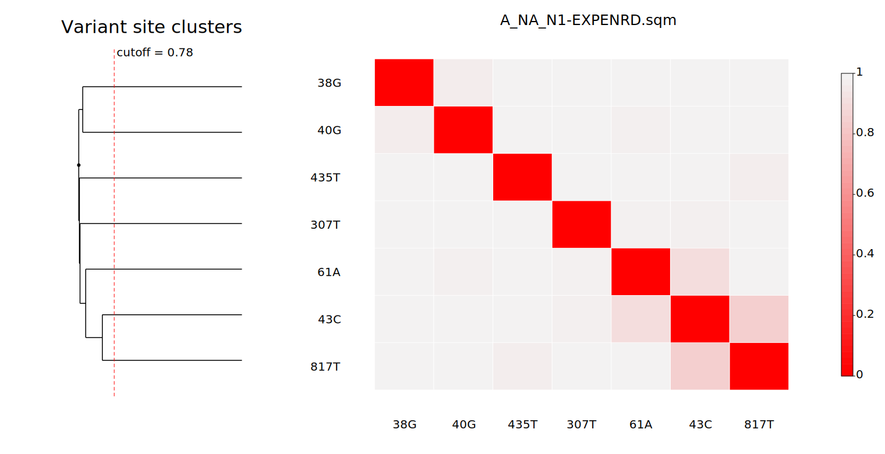
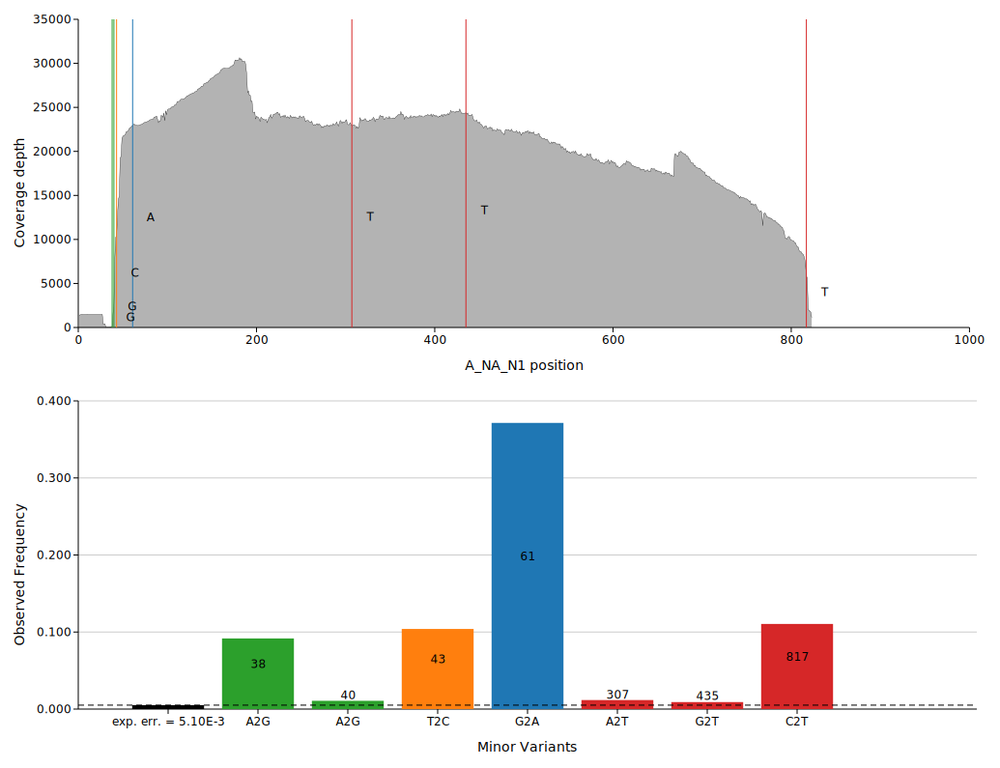

# IRMA-Viz

**As a first step, this document is under governance review. When the review
completes as appropriate per local and agency processes, the project team will
be allowed to remove this notice. This material is draft.**

## Overview

`irma-viz` is a Rust command-line tool for rendering
[IRMA](https://wonder.cdc.gov/amd/flu/irma/) report plots as SVG files. The tool
automates the visualization of IRMA's matrix and table outputs.



### Purpose

To provide fast, reliable plotting for IRMA reports, enabling
streamlined analysis workflows.

### Goals

- Reproduce the original IRMA visualization outputs faithfully
- Provide flexible configuration and command-line options for customization
- Maintain ease of use through configuration files and default settings

## Features

`irma-viz` reads an IRMA output directory containing `tables/` and `matrices/`
subdirectories, discovers viral `ctype`s (compound type) from the files that are
present, and renders:

- `READ_PERCENTAGES.svg` as either a sankey diagram or array of pie charts
- `{ctype}-heuristics.svg`
- `{ctype}-coverageDiagram.svg`
- `{ctype}-{matrix-type}.svg` for each enabled clustermap matrix type when
  matching matrix and variants inputs are present and the variants file has more
  than one variant

## Build

```bash
cargo build --profile prod
```

## Run

```bash
cargo run -- --input-root path/to/irma-run
```

The binary loads a `TOML` config, then applies CLI overrides on top. The path to
the config `TOML` is assumed to be in the current folder, unless otherwise
specified.

The `--input-root` (`-i`) must be specified, and should be the base path of the
`IRMA` run, where `IRMA-viz` expects a `matrices/` and `tables/` directory.

The output path will be in `input-root/figures` unless otherwise specified.

## Arguments

| Parameter              | Default                      | Kind    | Description                                                                                                                          |
| ---------------------- | ---------------------------- | ------- | ------------------------------------------------------------------------------------------------------------------------------------ |
| `--input-root` (`-i`)  | This argument is required    | Path    | The path to the base directory of an IRMA run                                                                                        |
| `--output-path` (`-o`) | `path/to/input/root/figures` | Path    | Output directory for the generated figures                                                                                           |
| `--config` (`-c`)      | `./config.toml`              | Path    | Path to config file. The default assumes that the file exists in the working directory                                               |
| `--read-percentages`   | True                         | Boolean | Toggles generation of the `READ_PERCENTAGES.svg` figure for the entire `IRMA` run                                                    |
| `--heuristics`         | True                         | Boolean | Toggles generation of the `{ctype}_heuristics.svg` figure for any discovered ctypes in the `IRMA` run                                |
| `--coverage`           | True                         | Boolean | Toggles generation of the `{ctype}_coverageDiagram.svg` figure of any discovered ctypes in the `IRMA` run                            |
| `--clustermap`         | True                         | Boolean | Toggles generation of the clustermaps if two or more variants are identified for a sample. See [Clustermap](#clustermap) for details |

## Plot-Specific CLI Arguments

These are CLI overrides for arguments within the configuration for specific plots.

Note that for plotting purposes, for the four heuristics parameters, these do
not affect the calculations or data in the plots, and are used solely for
reference lines and/or axis boundaries. These defaults are from `IRMA`'s `FLU`
module.

| Parameter                  | Plot             | Default      | Kind                      | Description                                                                                                                                                             |
| -------------------------- | ---------------- | ------------ | ------------------------- | ----------------------------------------------------------------------------------------------------------------------------------------------------------------------- |
| `--min-aq`                 | heuristics       | 24           | [0,64]                    | Minimum average allele quality score heuristic for calling insertion & single nucleotide variants                                                                       |
| `--min-f`                  | heuristics       | 0.008        | [0,1]                     | Minimum frequency heuristic for calling single nucleotide variants                                                                                                      |
| `--min-tcc`                | heuristics       | 100          | ≥ 1                       | Minimum coverage depth heuristic (tool coverage count) for calling variants                                                                                             |
| `--min-conf`               | heuristics       | 0.8          | [0,1]                     | Minimum confidence not machine error for single nucleotide variants                                                                                                     |
| `--coverage-variant-color` | coverage         | nucleotide   | "nucleotide", "frequency" | Controls colors for vertical reference line for each variant, which are colored either based on the nucleotide identity of the variant, or the frequency of the variant |
| `--read-percentages-viz`   | read-percentages | pie          | "pie", "sankey"           | Chooses between a dashboard of pie charts or a sankey flow diagram to describe the classifications of the reads throughout the IRMA run                                 |
| `--paired`                 | read-percentages | true         | boolean                   | Whether or not the sample was from paired-end data. Only affects the description text on the read-percentages plot                                                      |
| `--cluster-option`         | clustermap       | "clustermap" | "clustermap", "tree"      | Chooses between a clustermap or a phylogenetic tree with a heatmap for the clustermap plot                                                                              |
| `--tree-height`            | clustermap       | 0.78         | [0,1]                     | Tree height for agglomerative clustering of variant sites, if "tree" is selected for `--cluster-option`                                                                 |

## Plots

### Read Percentages

The read percentages figure shows a summary of all ctypes and their
categorizations within different steps of the entire IRMA run, displayed across
three pie charts. Note the `--paired` boolean flag affects the description text
for the pie charts.



The `--read-percentages-viz sankey` option shows a similar breakdown, aggregated into a single sankey flow diagram.



### Heuristics



The heuristics figure has multiple plots that summarize the distributions that
IRMA uses as reference points for variant calling decisions within a ctype.
Plots 1-4 use a kernel density estimation with Silverman's Rule of Thumb for
bandwidth selection.

1. Average allele quality
2. Zoomed view of the average allele quality
3. Observed allele frequency from 0 to 10%
4. Zoomed view of the observed allele frequency
5. Histogram of coverage depth
6. Histogram of confidence that an allele is not a machine error

`--min-aq` places a vertical reference line for average allele quality (1) and serves as the x-minimum for the zoomed quality plot (2)
`--min-f` places a vertical reference line for the observed allele frequency (3) and serves as the x-maximum for the zoomed frequency plot (4)
`--min-tcc` chooses where to add a vertical reference line for the coverage histogram (5)
`--min-conf` chooses where to add a vertical reference line for the confidence histogram (6)

These thresholds are shown for interpretation only: changing the corresponding
CLI arguments updates the reference lines and axis bounds in the plot, but does
not recalculate the underlying IRMA outputs.

### Clustermap

The clustermap is a square heatmap, where each row/column represents a variant
site, for example `43C` and `817T`. Each cell encodes the similarity between the
two sites. The lower the value, the higher the similarity between the sites, and
the darker the cell is colored.

There are up to four possible similarity matrices that IRMA can export for a given ctype, giving four possible heatmaps:

<!-- markdownlint-configure-file {"MD033": {"allowed_elements": ["img"]}} -->

- **EXPENRD**: Equal to Jaccard, unless the total number of read patterns that cover the sites being compared is less than or equal to 20, otherwise it uses a custom distance as fallback:   
- **JACCARD**: [Jaccard-style distance](https://en.wikipedia.org/wiki/Jaccard_index):   
- **MUTUALD**: A co-occurrence distance, calculated with:   
- **NJOINTP**: A simple distance from the joint frequency, calculated with:   

For these calculations:

- `joint` represents the frequency of the two alleles being observed together on the same reads
- `mn1`/`mn2` is the minimum of the observed frequency of allele `A` among reads spanning both sites and the overall called frequency of allele `A` at site `s1`/`s2`
- `mx1`/`mx2` is the maximum of the observed frequency of allele `A` among reads spanning both sites and the overall called frequency of allele `A` at site `s1`/`s2`
- `mnA` is the minimum of `mn2` and `mn1`
- The total is the number of reads spanning the two sites, weighted by pattern counts

Different matrices/clustermaps can be enabled or disabled within the `config.toml`.



The `--cluster-option tree` option does not change the heatmap, but adds more
focus to the phylogenetic tree paired with the heatmap. This version of the
dendrogram features scaled branch lengths, and the reference line shows the
cutoff for where variants are clustered together.



### Coverage

Creates a coverage line plot showing the volume of reads covering each position
along the length of the ctype. If two or more variants are found for the
ctype, an additional bar plot will be created showing the relative frequencies
of the variants.

The axis labels on the bar chart provide the original nucleotide identity of the
allele, followed by the variant nucleotide, and the number on the bar itself
represents the position of the allele. For example, a bar labeled `A2G` with
`38` on the bar represents an `A` being replaced with a `G` at position 38. The
colors of the bars and their relevant reference lines are based on the
nucleotide identity of the variant. The `exp_err.` bar and horizontal reference
line shows the threshold frequency for where variants are called, rather than
assumed to be errors.

If one or fewer variants are present, no bar graph will be generated.



## Notices

### Contact Info

For direct correspondence on the project, feel free to contact: [Samuel S.
Shepard](mailto:sshepard@cdc.gov), Influenza Division, National Center for
Immunization and Respiratory Diseases, Centers for Disease Control and
Prevention; or reach out to other [contributors](CONTRIBUTORS.md).

### Development Process

IRMA-Viz is maintained by contributors in CDC/NCIRD/ID who develop changes through
the project repository. Proposed changes should be made in a feature branch and
submitted as a pull request for review before they are merged.

### Public Domain Standard Notice

This repository constitutes a work of the United States Government and is not
subject to domestic copyright protection under 17 USC § 105. This repository is
in the public domain within the United States, and copyright and related rights
in the work worldwide are waived through the [CC0 1.0 Universal public domain
dedication](https://creativecommons.org/publicdomain/zero/1.0/). All
contributions to this repository will be released under the CC0 dedication. By
submitting a pull request you are agreeing to comply with this waiver of
copyright interest.

### License Standard Notice

The repository utilizes code licensed under the terms of the Apache Software
License and therefore is licensed under ASL v2 or later. This source code in
this repository is free: you can redistribute it and/or modify it under the
terms of the Apache Software License version 2, or (at your option) any later
version. This source code in this repository is distributed in the hope that it
will be useful, but WITHOUT ANY WARRANTY; without even the implied warranty of
MERCHANTABILITY or FITNESS FOR A PARTICULAR PURPOSE. See the Apache Software
License for more details. You should have received a copy of the Apache Software
License along with this program. If not, see:
<http://www.apache.org/licenses/LICENSE-2.0.html>. The source code forked from
other open source projects will inherit its license.

### Privacy Standard Notice

This repository contains only non-sensitive, publicly available data and
information. All material and community participation is covered by the
[Disclaimer](https://github.com/CDCgov/template/blob/main/DISCLAIMER.md). For
more information about CDC's privacy policy, please visit
<http://www.cdc.gov/other/privacy.html>.

### Contributing Standard Notice

Anyone is encouraged to contribute to the repository by
[forking](https://help.github.com/articles/fork-a-repo) and submitting a pull
request. (If you are new to GitHub, you might start with a [basic
tutorial](https://help.github.com/articles/set-up-git).) By contributing to this
project, you grant a world-wide, royalty-free, perpetual, irrevocable,
non-exclusive, transferable license to all users under the terms of the [Apache
Software License v2](http://www.apache.org/licenses/LICENSE-2.0.html) or later.

All comments, messages, pull requests, and other submissions received through
CDC including this GitHub page may be subject to applicable federal law,
including but not limited to the Federal Records Act, and may be archived. Learn
more at
[http://www.cdc.gov/other/privacy.html](http://www.cdc.gov/other/privacy.html).

### Records Management Standard Notice

This repository is not a source of government records, but is a copy to increase
collaboration and collaborative potential. All government records will be
published through the [CDC web site](http://www.cdc.gov).

## Additional Standard Notices

Please refer to [CDC's Template Repository](https://github.com/CDCgov/template)
for more information about [contributing to this
repository](https://github.com/CDCgov/template/blob/main/CONTRIBUTING.md),
[public domain notices and
disclaimers](https://github.com/CDCgov/template/blob/main/DISCLAIMER.md), and
[code of
conduct](https://github.com/CDCgov/template/blob/main/code-of-conduct.md).
