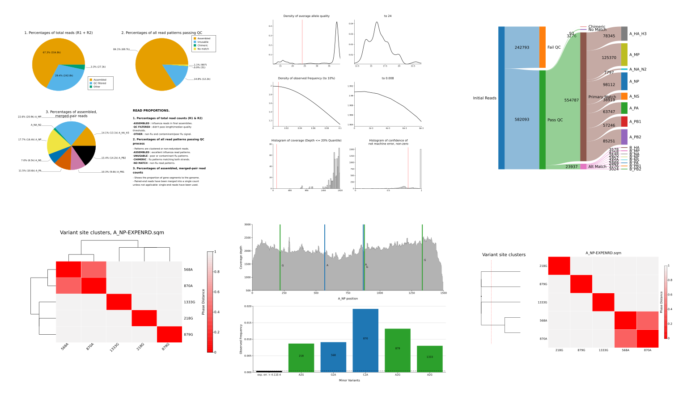
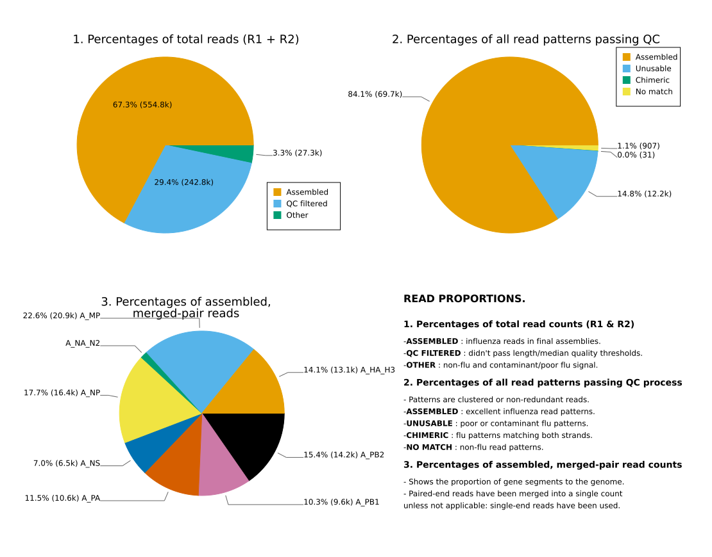
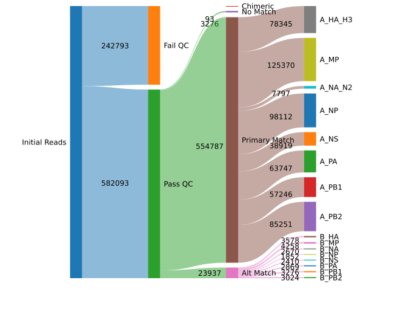
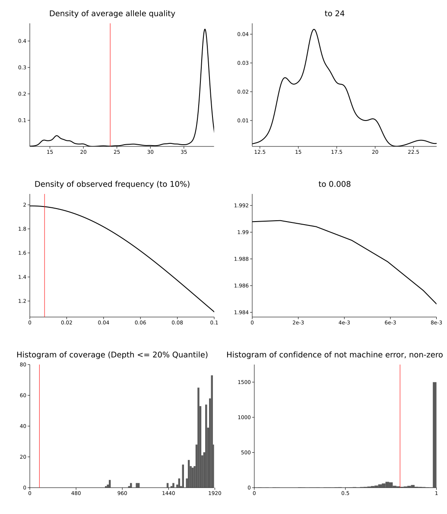
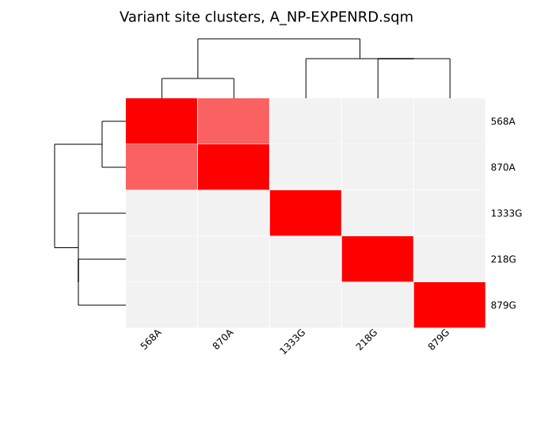
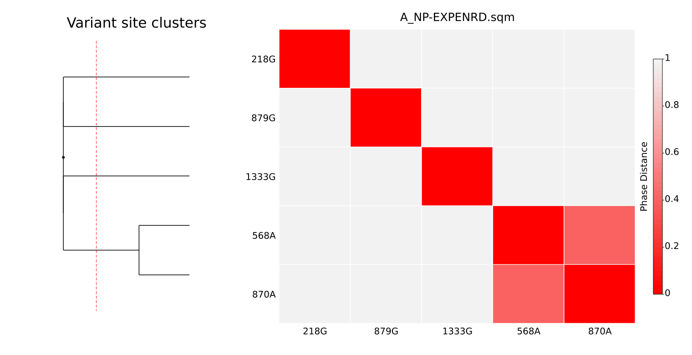
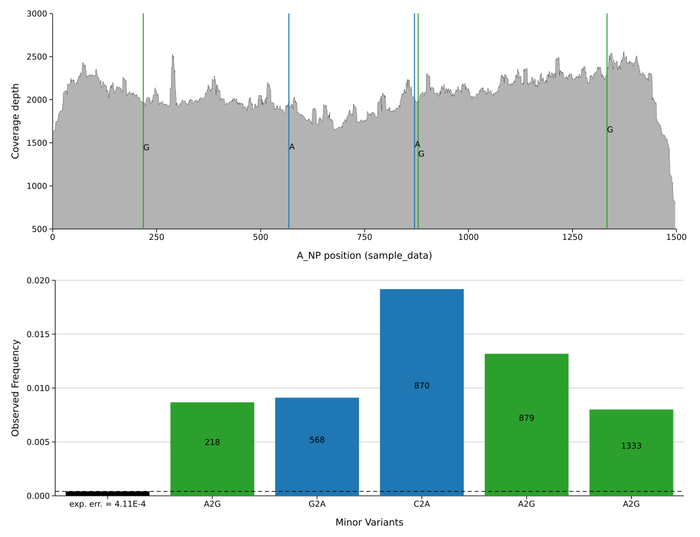
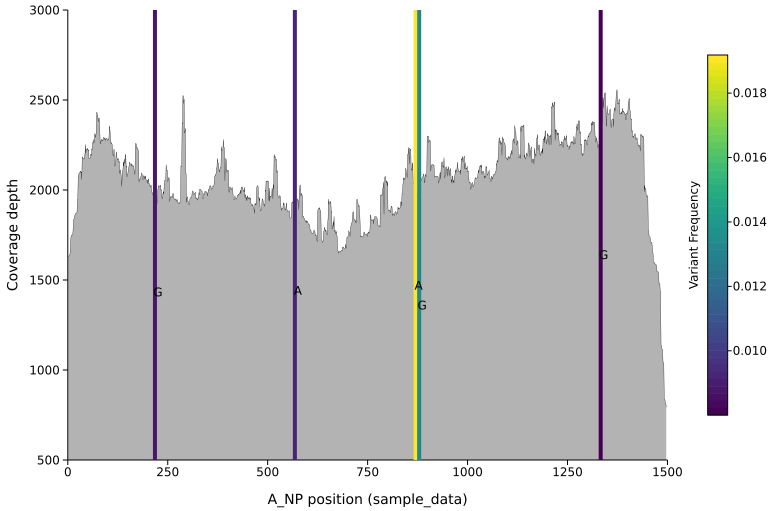

# irma-viz

## Overview

`irma-viz` is a Rust command-line tool for rendering
[IRMA](https://wonder.cdc.gov/amd/flu/irma/) report plots. The tool automates
the visualization of IRMA's matrix and table outputs.



### Purpose

To provide fast, reliable plotting for IRMA reports, enabling
streamlined analysis workflows.

### Goals

- Reproduce the original IRMA visualization outputs faithfully
- Provide flexible configuration and command-line options for customization
- Maintain ease of use through configuration files and default settings

## Features

`irma-viz` reads an IRMA out directory containing `tables/` and `matrices/`
subdirectories, discovers candidate `ctype`s (compound-types) independently for
each figure, if applicable, and renders the enabled plots.

| Figure                                     | Required input                                                                                                                             |
| ------------------------------------------ | ------------------------------------------------------------------------------------------------------------------------------------------ |
| `READ_PERCENTAGES` Sankey or pie dashboard | `tables/READ_COUNTS.txt`                                                                                                                   |
| `{target}-heuristics`                      | `tables/{target}-allAlleles.txt`                                                                                                           |
| `{target}-coverageDiagram`                 | `tables/{target}-variants.txt`, `tables/{target}-coverage.txt`, and `tables/{target}-pairingStats.txt`                                     |
| `{target}-{matrix-type}`                   | `tables/{target}-variants.txt` and an enabled `matrices/{target}-{matrix-type}.sqm`; the variants table must contain more than one variant |

Figures can be exported in `.pdf` or `.svg` formats. The format is selected by
`[output_options].output_format` in `irma-viz-config.toml`, with the supplied
default selecting `.pdf`.

## Build

```bash
cargo build --profile prod
```

## Run

To run `irma-viz`, use the following command. You may need to replace `irma-viz` with a path to the binary, or use `cargo run --` if it is not already compiled.

```bash
irma-viz --input-root path/to/irma-run --paired true
```

Note: if `READ_PERCENTAGES` plots are toggled on, and `viz_option = "pie"`
which is the case with the default `config.toml` settings, `--paired` is a
required CLI argument. Otherwise, the argument is not required or read.

### Demo

With the `demo` feature enabled, you can render the repository's demo assets
for an explicit target:

```bash
cargo build --features demo

irma-viz --input-root path/to/irma-run --demo-target A_NP --paired true
```

Demo mode always writes SVGs to `demo/`. It renders read-percentage plots in
both styles, coverage plots in both color modes, one heuristics figure, a
heatmap and heatmap-with-tree figure, and `combined.svg`, which combines all of
the aforementioned plots into one grid. It requires the inputs for all of those
figures, including more than one variant and an available matrix.

### Config

The binary loads a TOML configuration, then applies CLI overrides. By default,
it reads `irma-viz-config.toml` from the current working directory; use
`--config` to select another path. The configuration must include every table
shown in the supplied [`irma-viz-config.toml`](irma-viz-config.toml).

The `--input-root` (`-i`) must be specified, and should be the base path of the
IRMA run, where `irma-viz` expects `matrices/` and `tables/` directories for
ctype-specific figures.

The output path is `path/to/input-root/figures` unless otherwise specified. The
output directory is created if it does not yet exist.

Since the heuristics thresholds `--min-variant-average-quality`,
`--min-variant-frequency`, `--min-variant-depth`, and
`--min-confidence-not-sequencer-error` are expected to vary by IRMA module, they
are passed via CLI. If omitted, `irma-viz` uses the defaults listed below.

## Arguments

### General CLI Arguments and Plot Toggles

| Parameter              | Default                      | Kind    | Description                                                                                                           |
| ---------------------- | ---------------------------- | ------- | --------------------------------------------------------------------------------------------------------------------- |
| `--input-root` (`-i`)  | This argument is required    | Path    | The path to the base directory of an IRMA run                                                                         |
| `--output-path` (`-o`) | `path/to/input/root/figures` | Path    | Output directory for the generated figures                                                                            |
| `--config` (`-c`)      | `./irma-viz-config.toml`     | Path    | TOML configuration path, relative to the current directory by default                                                 |
| `--read-percentages`   | `true` in `config.toml`      | Boolean | Overrides generation of the run-level `READ_PERCENTAGES` figure                                                       |
| `--heuristics`         | `true` in `config.toml`      | Boolean | Overrides generation of `{ctype}-heuristics` figures for discovered targets                                           |
| `--coverage`           | `true` in `config.toml`      | Boolean | Overrides generation of `{ctype}-coverageDiagram` figures for discovered targets                                      |
| `--clustermap`         | `true` in `config.toml`      | Boolean | Overrides generation of enabled (ctype, matrix) clustermaps with more than one variant; see [Clustermap](#clustermap) |

### Plot-Specific CLI Arguments

These options are provided by CLI. The heuristics parameters are used only for
plot reference lines and axis boundaries; changing them does not recalculate the
underlying IRMA outputs. These defaults are from `IRMA`'s `FLU` module.

| Parameter                              | Plot             | Default                          | Type     | Description                                                                                                              |
| -------------------------------------- | ---------------- | -------------------------------- | -------- | ------------------------------------------------------------------------------------------------------------------------ |
| `--min-variant-average-quality`        | heuristics       | 24.0                             | \[0,64\] | Average-allele-quality reference line and zoom-panel upper bound                                                         |
| `--min-variant-frequency`              | heuristics       | 0.008                            | \[0,1\]  | Minority-allele-frequency reference line and zoom-panel upper bound                                                      |
| `--min-variant-depth`                  | heuristics       | 100                              | ≥ 1      | Coverage-depth histogram reference line                                                                                  |
| `--min-confidence-not-sequencer-error` | heuristics       | 0.8                              | \[0,1\]  | Confidence histogram reference line                                                                                      |
| `--paired`                             | read-percentages | Required for enabled pie output  | Boolean  | Selects paired-end wording in the pie dashboard if `viz_option = "pie"` is set; otherwise is not read                    |
| `--tree-height`                        | clustermap       | `0.78` in `irma-viz-config.toml` | \[0,1\]  | Overrides the displayed dendrogram cutoff line in the clustermap if `cluster_option = "tree"` is set; otherwise not used |

### General TOML Options and Plot Toggles

The TOML configuration selects the output format and enables or disables plots.
The plot toggles can be overridden via CLI. Note that if a plot type is enabled,
it will only be generated if all required data is present and valid.

| Section            | Option             | Values           | Default | Description                                                                                                        |
| ------------------ | ------------------ | ---------------- | ------- | ------------------------------------------------------------------------------------------------------------------ |
| `[output_options]` | `output_format`    | `"pdf"`, `"svg"` | `"pdf"` | The output file format for rendered figures                                                                        |
| `[plot_toggles]`   | `read_percentages` | boolean          | `true`  | Toggles the run-level `READ_PERCENTAGES` figure                                                                    |
| `[plot_toggles]`   | `clustermap`       | boolean          | `true`  | Toggles `clustermap` figures for each available (`ctype`, matrix) combination, using [enabled matrices](#matrices) |
| `[plot_toggles]`   | `heuristics`       | boolean          | `true`  | Toggles `heuristics` figures for each available `ctype`                                                            |
| `[plot_toggles]`   | `coverage`         | boolean          | `true`  | Toggles `coverageDiagram` figures for each available `ctype`                                                       |

### Plot-Specific TOML Options

These options are configured in `config.toml`.

| Section                | Option           | Values                                                                                                                              | Default        | Description                                                                                                                                                                   |
| ---------------------- | ---------------- | ----------------------------------------------------------------------------------------------------------------------------------- | -------------- | ----------------------------------------------------------------------------------------------------------------------------------------------------------------------------- |
| `[heuristics_options]` | `enabled_plots`  | Booleans for `allele_quality`, `quality_subplot`, `allele_frequency`, `frequency_subplot`, `coverage_depth_hist`, `confidence_hist` | All `true`     | Selects which heuristics subplots to generate. If heuristics plotting is enabled, at least one subplot must also be enabled.                                                  |
| `[coverage_options]`   | `variant_color`  | `"nucleotide"`, `"frequency"`                                                                                                       | `"nucleotide"` | Colors variant coverage annotations by nucleotide idminority nucleotide entity or frequency. If `"frequency"` is selected, the corresponding bar chart will be omitted        |
| `[percent_options]`    | `viz_option`     | `"pie"`, `"sankey"`                                                                                                                 | `"pie"`        | Chooses the read-percentages visualization style                                                                                                                              |
| `[cluster_options]`    | `cluster_option` | `"clustermap"`, `"tree"`                                                                                                            | `"clustermap"` | Chooses between a heatmap or phylogram-plus-heatmap layout for displaying variant clustering                                                                                  |
| `[cluster_options]`    | `matrix_types`   | booleans for `expenrd`, `jaccard`, `mutuald`, and `njointp`                                                                         | All `true`     | Selects matrix types eligible for clustermap figures (see [Matrices](#matrices))                                                                                              |
| `[cluster_options]`    | `tree_height`    | Number from 0 to 1                                                                                                                  | `0.78`         | Positions the dendrogram cutoff line in the phylogram-plus-heatmap figure if `cluster_option = "tree"` is set; otherwise not used. Overridden by `--tree-height` CLI argument |

## Plots

### Read Percentages

The read percentages figure shows a summary of all ctypes and their
categorizations within different steps of the entire IRMA run. If the pie option
is selected, this will be  displayed across three pie charts. Note the
`--paired` boolean option affects the description text for the pie charts.



A sankey flow diagram showing a similar breakdown can be enabled instead of the
pie charts by setting `viz_option = "sankey"` under `[percent_options]` in
`config.toml`.



### Heuristics



The heuristics figure features multiple subplots that summarize the
distributions that IRMA uses when evaluating variants for one target. The
density plots (1–4) use a kernel density estimate with [Silverman's
rule-of-thumb
bandwidth](https://www.sciencedirect.com/topics/mathematics/silverman).

1. Average allele quality
2. Zoomed view of the average allele quality
3. Observed allele frequency from 0 to 10%
4. Zoomed view of the observed allele frequency
5. Histogram of coverage depth at or below the 20th percentile
6. Histogram of positive confidence that an allele is not a machine error

Each plot may be individually toggled within the `config.toml`.

Some of the heuristics plots are affected by the following CLI arguments:

- `--min-variant-average-quality` places a vertical reference line for average
allele quality (1) and serves as the x-maximum for the zoomed quality plot (2).
- `--min-variant-frequency` places a vertical reference line for the observed
allele frequency (3) and serves as the x-maximum for the zoomed frequency plot
(4).
- `--min-variant-depth` chooses where to add a vertical reference line for the
coverage histogram (5).
- `--min-confidence-not-sequencer-error` chooses where to add a vertical
reference line for the confidence histogram (6).

These thresholds are shown for interpretation only: changing the corresponding
CLI arguments updates the reference lines and axis bounds in the plot, but does
not recalculate the underlying IRMA outputs.

### Clustermap

The clustermap is a square heatmap, where each row and column represents a
variant site, for example `43C` and `817T`. Each cell encodes the distance
between the two sites: lower values indicate higher similarity between sites,
and are colored darker.

#### Matrices

There are up to four similarity matrices that IRMA can export for a given
`ctype`, each of which can produce a heatmap:

<!-- markdownlint-configure-file {"MD033": {"allowed_elements": ["img"]}} -->

- **EXPENRD**: Equal to JACCARD only when more than 20 weighted read patterns
  span both sites and both MUTUALD and JACCARD are nonzero; otherwise it uses:
  
- **JACCARD**: A [Jaccard-style
  distance](https://en.wikipedia.org/wiki/Jaccard_index): 
- **MUTUALD**: A co-occurrence distance: 
- **NJOINTP**: A distance from joint frequency: 

For these calculations:

- `joint` is the fraction of read patterns spanning both sites that carry both
  selected variant alleles
- `mn1`/`mn2` is the minimum of the selected allele's frequency among reads
  spanning both sites and its overall called frequency at site `s1`/`s2`
- `mx1`/`mx2` is the maximum of those same two frequencies at site `s1`/`s2`
- `mnA` is the minimum of `mn2` and `mn1`
- - `total` is the number of reads spanning the two sites, weighted by pattern
  counts

Different matrices/clustermaps can be enabled or disabled within
`irma-viz-config.toml`.



Setting `cluster_option = "tree"` under `[cluster_options]` does not change the
heatmap values, but adds more focus to the phylogenetic tree paired with the
heatmap. This version of the dendrogram features scaled branch lengths, and the
reference line shows the cutoff where variants are clustered together.

The `tree_height` option under `[cluster_options]` in `irma-viz-config.toml`,
overridden by the `--tree-height` CLI flag, controls the displayed dendrogram
cutoff line in the tree layout.



### Coverage

The coverage figure shows coverage depth at each position along a target. When
variants are available and `variant_color = "nucleotide"`, an additional bar
chart shows their observed frequencies.

The bar-chart labels show the consensus allele followed by the minority allele,
and the number on a bar is its position. For example, a bar labeled `A2G` with
`38` on the bar represents consensus `A` and minority `G` at position 38. Bar
colors and their reference lines follow the minority nucleotide. When the bar
chart is shown and the pairing statistics contain `ExpectedErrorRate`, the `exp.
err.` bar and horizontal line show that value; variant lines below it are black.



When `variant_color = "frequency"`, variant reference lines are colored by
observed frequency and the variant-frequency bar plot is not generated.



## Notices

### Contact Info

For direct correspondence on the project, feel free to contact: [Samuel S.
Shepard](mailto:sshepard@cdc.gov), Influenza Division, National Center for
Immunization and Respiratory Diseases, Centers for Disease Control and
Prevention; or reach out to other [contributors](CONTRIBUTORS.md).

### Development Process

irma-viz is maintained by contributors in CDC/NCIRD/ID who develop changes
through the project repository. Proposed changes should be made in a feature
branch and submitted as a pull request for review before they are merged.

### Public Domain Standard Notice

This repository constitutes a work of the United States Government and is not
subject to domestic copyright protection under 17 USC § 105. This repository is
in the public domain within the United States, and copyright and related rights
in the work worldwide are waived through the [CC0 1.0 Universal public domain
dedication](https://creativecommons.org/publicdomain/zero/1.0/). All
contributions to this repository will be released under the CC0 dedication. By
submitting a pull request you are agreeing to comply with this waiver of
copyright interest.

### License Standard Notice

The repository utilizes code licensed under the terms of the Apache Software
License and therefore is licensed under ASL v2 or later. This source code in
this repository is free: you can redistribute it and/or modify it under the
terms of the Apache Software License version 2, or (at your option) any later
version. This source code in this repository is distributed in the hope that it
will be useful, but WITHOUT ANY WARRANTY; without even the implied warranty of
MERCHANTABILITY or FITNESS FOR A PARTICULAR PURPOSE. See the Apache Software
License for more details. You should have received a copy of the Apache Software
License along with this program. If not, see:
<http://www.apache.org/licenses/LICENSE-2.0.html>. The source code forked from
other open source projects will inherit its license.

### Privacy Standard Notice

This repository contains only non-sensitive, publicly available data and
information. All material and community participation is covered by the
[Disclaimer](https://github.com/CDCgov/template/blob/main/DISCLAIMER.md). For
more information about CDC's privacy policy, please visit
<http://www.cdc.gov/other/privacy.html>.

### Contributing Standard Notice

Anyone is encouraged to contribute to the repository by
[forking](https://help.github.com/articles/fork-a-repo) and submitting a pull
request. (If you are new to GitHub, you might start with a [basic
tutorial](https://help.github.com/articles/set-up-git).) By contributing to this
project, you grant a world-wide, royalty-free, perpetual, irrevocable,
non-exclusive, transferable license to all users under the terms of the [Apache
Software License v2](http://www.apache.org/licenses/LICENSE-2.0.html) or later.

All comments, messages, pull requests, and other submissions received through
CDC including this GitHub page may be subject to applicable federal law,
including but not limited to the Federal Records Act, and may be archived. Learn
more at
[http://www.cdc.gov/other/privacy.html](http://www.cdc.gov/other/privacy.html).

### Records Management Standard Notice

This repository is not a source of government records, but is a copy to increase
collaboration and collaborative potential. All government records will be
published through the [CDC web site](http://www.cdc.gov).

## Additional Standard Notices

Please refer to [CDC's Template Repository](https://github.com/CDCgov/template)
for more information about [contributing to this
repository](https://github.com/CDCgov/template/blob/main/CONTRIBUTING.md),
[public domain notices and
disclaimers](https://github.com/CDCgov/template/blob/main/DISCLAIMER.md), and
[code of
conduct](https://github.com/CDCgov/template/blob/main/code-of-conduct.md).
